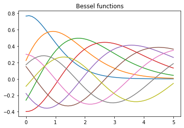
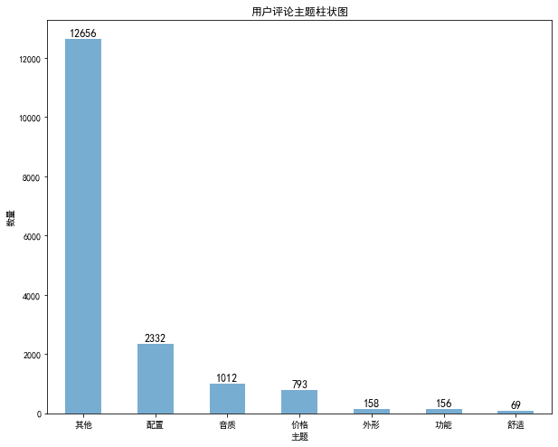
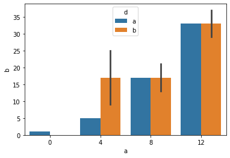
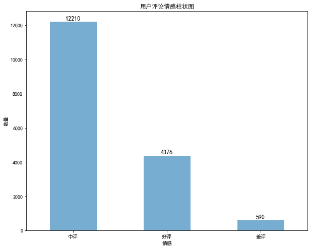
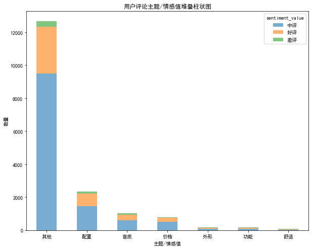
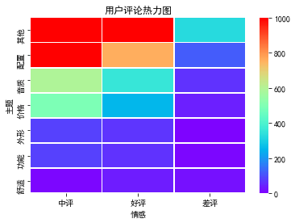
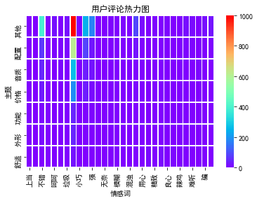
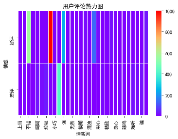

```python
# 查看当前kernel下已安装的包  list packages
!pip list --format=columns
```


```python
# 安装拓展包
pip install some_package --user
```


```python
# 举例：安装sklearn某依赖库
!pip install sklearn2pmml --user
```

    Looking in indexes: https://mirrors.aliyun.com/pypi/simple
    Collecting sklearn2pmml
      Downloading https://mirrors.aliyun.com/pypi/packages/d7/b6/7fffdc09ce9bc3ccb1763b444f9f3111bc297989e3ae85447120b7a9e09a/sklearn2pmml-0.71.1.tar.gz (5.9 MB)
         |████████████████████████████████| 5.9 MB 1.5 MB/s eta 0:00:01
    [?25hRequirement already satisfied: joblib>=0.13.0 in /opt/conda/lib/python3.6/site-packages (from sklearn2pmml) (1.0.0)
    Requirement already satisfied: scikit-learn>=0.18.0 in /opt/conda/lib/python3.6/site-packages (from sklearn2pmml) (0.24.0)
    Collecting sklearn-pandas>=0.0.10
      Downloading https://mirrors.aliyun.com/pypi/packages/30/71/ccd5222f731993dfc1a6d9e766a507f1859bda4930b9548e54c11c876baf/sklearn_pandas-2.2.0-py2.py3-none-any.whl (10 kB)
    Requirement already satisfied: numpy>=1.13.3 in /opt/conda/lib/python3.6/site-packages (from scikit-learn>=0.18.0->sklearn2pmml) (1.19.4)
    Requirement already satisfied: threadpoolctl>=2.0.0 in /opt/conda/lib/python3.6/site-packages (from scikit-learn>=0.18.0->sklearn2pmml) (2.1.0)
    Requirement already satisfied: scipy>=0.19.1 in /opt/conda/lib/python3.6/site-packages (from scikit-learn>=0.18.0->sklearn2pmml) (1.5.4)
    Requirement already satisfied: pandas>=1.1.4 in /opt/conda/lib/python3.6/site-packages (from sklearn-pandas>=0.0.10->sklearn2pmml) (1.1.5)
    Requirement already satisfied: pytz>=2017.2 in /opt/conda/lib/python3.6/site-packages (from pandas>=1.1.4->sklearn-pandas>=0.0.10->sklearn2pmml) (2020.5)
    Requirement already satisfied: python-dateutil>=2.7.3 in /opt/conda/lib/python3.6/site-packages (from pandas>=1.1.4->sklearn-pandas>=0.0.10->sklearn2pmml) (2.8.1)
    Requirement already satisfied: six>=1.5 in /opt/conda/lib/python3.6/site-packages (from python-dateutil>=2.7.3->pandas>=1.1.4->sklearn-pandas>=0.0.10->sklearn2pmml) (1.15.0)
    Building wheels for collected packages: sklearn2pmml
      Building wheel for sklearn2pmml (setup.py) ... [?25ldone
    [?25h  Created wheel for sklearn2pmml: filename=sklearn2pmml-0.71.1-py3-none-any.whl size=5900697 sha256=93b68c83a50629fa4f13c8c2204aba4d8170147e5767a8b315725ffcb58ed29a
      Stored in directory: /home/admin/.cache/pip/wheels/7e/fe/54/a68c461fce92cc5d5012cf4461e4cb131e84adcba4d0d5134a
    Successfully built sklearn2pmml
    Installing collected packages: sklearn-pandas, sklearn2pmml
    Successfully installed sklearn-pandas-2.2.0 sklearn2pmml-0.71.1
    WARNING: You are using pip version 21.0.1; however, version 21.1.2 is available.
    You should consider upgrading via the '/opt/conda/bin/python -m pip install --upgrade pip' command.


```python
# 举例：绘图案例 an example of matplotlib
%matplotlib inline
import numpy as np
import matplotlib.pyplot as plt
from scipy.special import jn
from IPython.display import display, clear_output
import time
x = np.linspace(0,5)
f, ax = plt.subplots()
ax.set_title("Bessel functions")

for n in range(1,10):
    time.sleep(1)
    ax.plot(x, jn(x,n))
    clear_output(wait=True)
    display(f)

# close the figure at the end, so we don't get a duplicate
# of the last plot
plt.close()
```


    

    


```python
import pandas as pd
data=pd.read_csv('earphone_sentiment.csv')
data['sentiment_word'].value_counts()
data['sentiment_value'].value_counts()
```


     0    12210
     1     4376
    -1      590
    Name: sentiment_value, dtype: int64


```python
pip install wordcloud  #  安装词云所需要的库
```

    Defaulting to user installation because normal site-packages is not writeable
    Looking in indexes: https://mirrors.aliyun.com/pypi/simple
    Collecting wordcloud
      Downloading https://mirrors.aliyun.com/pypi/packages/05/e7/52e4bef8e2e3499f6e96cc8ff7e0902a40b95014143b062acde4ff8b9fc8/wordcloud-1.8.1-cp36-cp36m-manylinux1_x86_64.whl (366 kB)
         |████████████████████████████████| 366 kB 1.5 MB/s eta 0:00:01
    [?25hRequirement already satisfied: pillow in /opt/conda/lib/python3.6/site-packages (from wordcloud) (8.0.1)
    Requirement already satisfied: matplotlib in /opt/conda/lib/python3.6/site-packages (from wordcloud) (3.3.3)
    Requirement already satisfied: numpy>=1.6.1 in /opt/conda/lib/python3.6/site-packages (from wordcloud) (1.19.4)
    Requirement already satisfied: cycler>=0.10 in /opt/conda/lib/python3.6/site-packages (from matplotlib->wordcloud) (0.10.0)
    Requirement already satisfied: pyparsing!=2.0.4,!=2.1.2,!=2.1.6,>=2.0.3 in /opt/conda/lib/python3.6/site-packages (from matplotlib->wordcloud) (2.4.7)
    Requirement already satisfied: python-dateutil>=2.1 in /opt/conda/lib/python3.6/site-packages (from matplotlib->wordcloud) (2.8.1)
    Requirement already satisfied: kiwisolver>=1.0.1 in /opt/conda/lib/python3.6/site-packages (from matplotlib->wordcloud) (1.2.0)
    Requirement already satisfied: six in /opt/conda/lib/python3.6/site-packages (from cycler>=0.10->matplotlib->wordcloud) (1.15.0)
    Installing collected packages: wordcloud
      WARNING: The script wordcloud_cli is installed in '/home/admin/.local/bin' which is not on PATH.
      Consider adding this directory to PATH or, if you prefer to suppress this warning, use --no-warn-script-location.
    Successfully installed wordcloud-1.8.1
    WARNING: You are using pip version 21.0.1; however, version 21.1.2 is available.
    You should consider upgrading via the '/opt/conda/bin/python -m pip install --upgrade pip' command.
    Note: you may need to restart the kernel to use updated packages.


```python
# # 导入词云制作第三方库wordcloud
# import wordcloud
# # 创建词云对象，赋值给w，现在w就表示了一个词云对象
# w=wordcloud.WordCloud()
# # 调用词云对象的generate方法，将文本传入
# w.generate('and that government of the people, by the people, for the people, shall not perish from the earth.')
# print("sda")
# # 将生成的词云保存为output1.png图片文件，保存出到当前文件夹中
# w.to_file('output1.png')
# import jieba.analyse
# from wordcloud import WordCloud
import wordcloud as wc
import pandas as pd
import matplotlib.pyplot as plt
from matplotlib import font_manager
font_manager.fontManager.addfont('simhei.ttf')
plt.rcParams['font.sans-serif'] = ['SimHei']
plt.rcParams['axes.unicode_minus'] = False
data=pd.read_csv('earphone_sentiment.csv')
word= ' '.join(data['sentiment_word'].dropna())
word_wc= wc.WordCloud(font_path='simhei.ttf',background_color='black',width=1000,height=1000,relative_scaling=0.3)
s=word_wc.generate(word)
s.to_file('key_word.jpg')
plt.imshow(s)
plt.axis('off')
plt.show()

```


    <Figure size 640x480 with 1 Axes>


```python
subject_data=pd.DataFrame(data['subject'].value_counts())
# plt.figure(figsize=(10,6))
picture=subject_data.plot.bar(alpha=0.6,figsize=(10,8))
picture.legend_.remove()
plt.xticks(rotation=0)
plt.title('用户评论主题柱状图')
plt.xlabel('主题')
plt.ylabel('数量')
#添加数字标签
import numpy as np

x=np.arange(len(subject_data.index))
yv=np.array(list(subject_data['subject']))
print(subject_data['subject'])
print(yv)
for a,b in zip(x,yv): ##控制标签位置
    plt.text(a, b+20, str(b), ha='center', va= 'bottom',fontsize=12)
plt.show()
```

    其他    12656
    配置     2332
    音质     1012
    价格      793
    外形      158
    功能      156
    舒适       69
    Name: subject, dtype: int64
    [12656  2332  1012   793   158   156    69]


    

    


```python
# import numpy as np
# import pandas as pd
# import seaborn as sns
# a=np.arange(40).reshape(10,4)
# df=pd.DataFrame(a,columns=['a','b','c','d'])
# df['a']=[0,4,4,8,8,8,4,12,12,12]
# df['d']=list('aabbabbbab')
# sns.barplot(x='a',y='b',data=df,hue='d')
# # import matplotlib.pyplot as plt 
# # num_list = [1.5,0.6,7.8,6]  
# # plt.bar(range(len(num_list)), num_list)  
# # plt.show() 

```


    

    


```python
#柱状图（不同情感）
sentiment_value_data=pd.DataFrame(data['sentiment_value'].value_counts())
print(data['sentiment_value'].value_counts())
# plt.figure(figsize=(10,6))
picture2=sentiment_value_data.plot.bar(alpha=0.6,figsize=(10,8))
picture2.legend_.remove()
plt.xticks(rotation=0)
plt.title('用户评论情感柱状图')
plt.xlabel('情感')
plt.ylabel('数量')
#添加数字标签
x1=np.arange(len(sentiment_value_data.index))
print(x1)
yv1=np.array(list(sentiment_value_data['sentiment_value']))
print(yv1)
for a,b in zip(x1,yv1): ##控制标签位置
    plt.text(a, b+20, str(b), ha='center', va= 'bottom',fontsize=12)
plt.show()
```

    中评    12210
    好评     4376
    差评      590
    Name: sentiment_value, dtype: int64
    [0 1 2]
    [12210  4376   590]


    

    


```python
# 不同情感词
sentiment_word_data=pd.DataFrame(data['sentiment_word'].value_counts())
print(sentiment_word_data)
picture3=sentiment_word_data.plot.bar(alpha=0.6,figsize=(10,8))
picture3.legend_.remove()
plt.xticks(rotation=0)
plt.title('用户评论情感词柱状图')
plt.xlabel('情感词')
plt.ylabel('数量')
x1=np.arange(len(sentiment_word_data.index))
yv1=np.array(list(sentiment_word_data['sentiment_word']))
for a,b in zip(x1,yv1): ##控制标签位置
    plt.text(a, b+20, str(b), ha='center', va= 'bottom',fontsize=12)
plt.show()
```

         sentiment_word
    好              3302
    不错              569
    差               415
    强               244
    牛               133
    垃圾               32
    高级               31
    追求               26
    呵呵               24
    难听               22
    骗                21
    舒适               16
    噪音               16
    用心               16
    疼                14
    音染               14
    水准               12
    轰                10
    良心                7
    惊艳                7
    精致                7
    无语                6
    无奈                5
    不舒服               4
    充足                3
    小巧                3
    模糊                2
    上当                2
    辣鸡                2
    混浊                1


    

    


```python
# 叠状柱图
subject_value_data=data[['subject','sentiment_value']]
subject_value_data2=pd.crosstab(subject_value_data['subject'],subject_value_data['sentiment_value'],margins=True)
subject_value_data3=subject_value_data2.sort_values(by='All',ascending = False).drop('All',axis=0).drop('All',axis=1)
subject_value_data3
picture4=subject_value_data3.plot.bar(alpha=0.6,stacked=True,figsize=(10,8))
plt.xticks(rotation=0)
plt.title('用户评论主题/情感值堆叠柱状图')
plt.xlabel('主题/情感值')
plt.ylabel('数量')
plt.show()
```


    

    


```python
#主题/情感热力图
# plt.imshow(subject_value_data3,vmax=1000,cmap='rainbow',vmin=0)
import seaborn as sns
sns.heatmap(subject_value_data3,vmax=1000,cmap='rainbow',vmin=0, linewidths=0.5)
plt.title('用户评论热力图')
plt.xlabel('情感')
plt.ylabel('主题')
plt.show()
```


    

    


```python
subject_value_data=data[['subject','sentiment_word']]
subject_value_data2=pd.crosstab(subject_value_data['subject'],subject_value_data['sentiment_word'],margins=True)
subject_value_data3=subject_value_data2.sort_values(by='All',ascending = False).drop('All',axis=0).drop('All',axis=1)
subject_value_data3
import seaborn as sns
sns.heatmap(subject_value_data3,vmax=1000,cmap='rainbow',vmin=0, linewidths=0.5)
plt.title('用户评论热力图')
plt.xlabel('情感词')
plt.ylabel('主题')
plt.show()
```


    

    


```python
subject_value_data=data[['sentiment_value','sentiment_word']]
subject_value_data2=pd.crosstab(subject_value_data['sentiment_value'],subject_value_data['sentiment_word'],margins=True)
subject_value_data3=subject_value_data2.sort_values(by='All',ascending = False).drop('All',axis=0).drop('All',axis=1)
subject_value_data3
import seaborn as sns
sns.heatmap(subject_value_data3,vmax=1000,cmap='rainbow',vmin=0, linewidths=0.5)
plt.title('用户评论热力图')
plt.xlabel('情感词')
plt.ylabel('情感')
plt.show()
```


    

    

